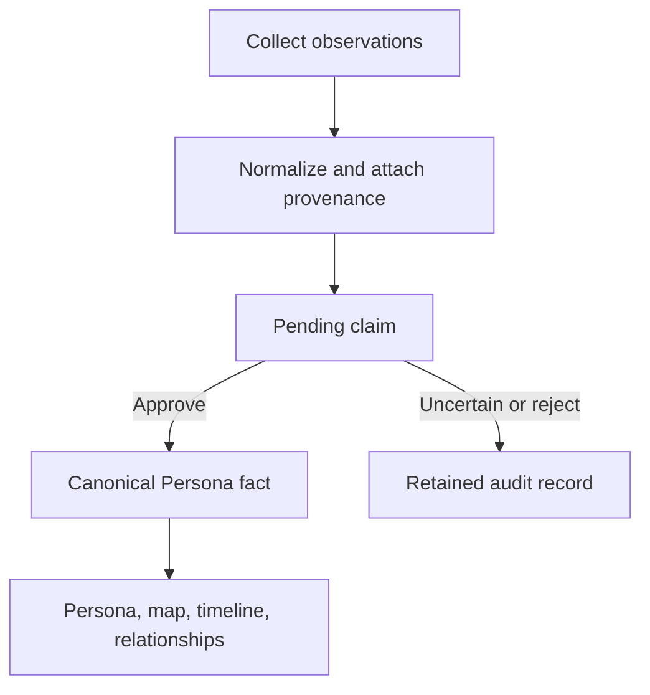
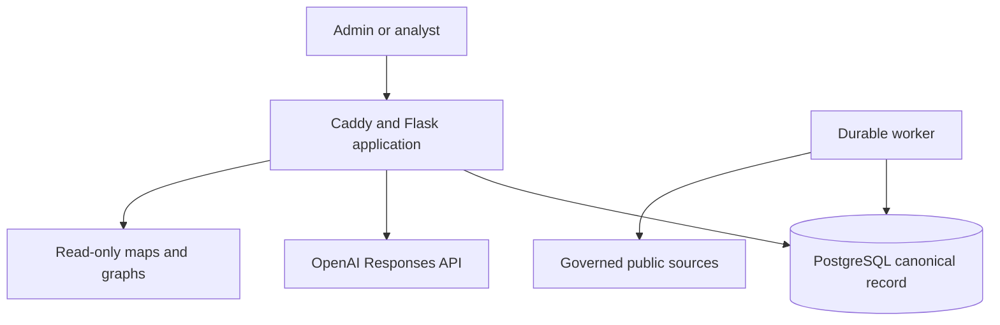

<p align="center">
  
</p>

<h1 align="center">OpenLedger</h1>

<p align="center">
  Governed OSINT case intelligence for evidence-backed investigations.
</p>

<p align="center">
  <a href="https://github.com/nexorusio/openledger/actions/workflows/python-package.yml"></a>
  <a href="https://github.com/nexorusio/openledger/actions/workflows/openledger-persistence.yml"></a>
  <a href="https://github.com/nexorusio/openledger/actions/workflows/codeql-analysis.yml"></a>
  <a href="https://github.com/nexorusio/openledger/actions/workflows/osint-source-audit.yml"></a>
  <a href="LICENSE"></a>
</p>

OpenLedger turns public-source findings into durable cases, reviewable Personas,
evidence timelines, maps, and relationship leads. Collection and AI systems may
propose evidence, but only a human analyst can approve a claim as part of the
canonical case record.

> [!IMPORTANT]
> OpenLedger is intended for lawful, authorized investigations. A discovered
> account, shared attribute, exact-name database result, or AI suggestion is not
> proof of identity, association, wrongdoing, or current activity. Verify every
> material conclusion against its underlying evidence and applicable policy.

## Why OpenLedger

Most username-search tools end with a report. OpenLedger adds the operational
layer required to turn collection output into a governed investigation:

- durable cases and worker jobs backed by PostgreSQL;
- typed Persona claims with evidence, confidence, and complete source lineage;
- pending, approved, uncertain, and rejected review states;
- case-scoped evidence timelines and persistent analyst chat;
- maps and relationship projections built only from approved claims;
- administrator and analyst roles;
- bounded, independently degradable OSINT adapters; and
- deployment, backup, migration, source-audit, and upstream-maintenance controls.

## Core workspaces

| Workspace | Purpose |
|---|---|
| New investigation | Plan bounded searches from usernames, profile URLs, names, email or phone context, and case-specific category/country filters. |
| Cases | Retain investigation jobs, Personas, evidence, chat, review history, and lifecycle state. |
| Persona | Review identity, contact and location, digital presence, affiliations, and risk-related proposals. |
| Timeline | Read a time-ordered projection of investigation events, evidence observations, and analyst decisions. |
| Relationships | Explore one Persona's evidence network or exact shared attributes across Personas. |
| Case chat | Analyze retained case context, optionally research the public web with citations, and submit review-gated proposals. |
| Settings | Configure system behavior, the server-side OpenAI connection, and analyst accounts. Administrator only. |

## Evidence governance

PostgreSQL is the canonical system of record. Reports, maps, graphs, collectors,
and AI are adapters or projections around it; they do not own Persona facts.



The principal rules are:

1. Every derived claim retains its source engine, source record, evidence, and
   observation history.
2. New claims enter pending review. AI and collectors cannot approve them.
3. Re-running a case may add evidence or refresh observation time, but it does
   not erase a human decision.
4. Rejected records remain auditable while staying out of default Persona,
   map, and shared-relationship projections.
5. Shared graph edges represent an exact approved attribute in common—not a
   proven personal relationship.
6. Extrapolations and hypotheses may remain in analysis or chat, but never
   become Persona facts.

See [Case intelligence architecture](docs/case-intelligence-architecture.md)
for the complete data and review contract.

## Collection and enrichment

OpenLedger retains Maigret as its public-account discovery foundation and adds
governed adapters through the existing worker and evidence model.

| Source | OpenLedger use | Boundary |
|---|---|---|
| Maigret and Socid Extractor | Public account discovery and normalized profile evidence. | Account matches and extracted values remain reviewable evidence. |
| User Scanner | Optional email-registration observations. | One-subject mode and explicit opt-in; notification-producing and adult modules remain disabled. |
| GitHub public API | Enrich exact claimed GitHub user profiles. | Fixed origin, no credential, bounded profiles and response size. |
| Unfurl | Decompose claimed profile URLs. | Pinned, offline, isolated runtime with remote lookups disabled. |
| Wayback CDX | Record historical capture metadata for exact claimed URLs. | No wildcard search and no archived page download. |
| Wikidata | Resolve an approved affiliation, its official website, and explicitly affiliated people. | Ambiguity requires selection; discovered claims remain pending. |
| GLEIF Global LEI Index | Search legal entities by approved affiliation name and ISO jurisdiction. | Candidate evidence only; a missing LEI match does not prove that a business is unregistered. |
| French National Enterprise Directory | Search France-registered entities and public leadership records. | Only one exact legal-name match may propose people; birth and nationality data are not retained. |
| Cloudflare DNS-over-HTTPS | Collect current A, AAAA, MX and NS records for one opted-in official website domain. | Observation-only technical context; DNS, hosting and registrar geography never establish where a business operates. |
| Wikipedia | Propose a biography summary, page identifier, and available lead image for an approved name. | Ambiguous pages require analyst selection. |
| ICIJ Offshore Leaks | Alert on exact-name Officer candidates for an approved name. | Potential-match alert only; independent identity confirmation is mandatory. |

The governed registry is [`config/osint-sources.json`](config/osint-sources.json).
Admission rules, review intervals, runtime limits, and contract checks are
documented in [Governed OSINT source maintenance](docs/osint-source-maintenance.md).

## AI assistance

OpenLedger reuses one server-side OpenAI connection configured by an
administrator. The key is stored in a protected runtime file and is never
returned to the browser.

AI can:

- summarize normalized case evidence;
- perform optional public-web research with clickable citations;
- answer questions in a persistent case conversation; and
- propose allowlisted, cited Persona updates for analyst review.

AI cannot approve or reject claims, silently merge identities, convert an
inference into a fact, or bypass the evidence and review model. A cited research
run with no usable citations is rejected instead of being saved as a successful
assessment.

## Architecture



- **Web application:** Flask, Jinja, JavaScript, Leaflet, and a pinned
  vis-network bundle.
- **Canonical storage:** PostgreSQL 17 with Alembic migrations.
- **Execution:** a separate durable worker claims jobs from PostgreSQL; closing
  the browser does not stop collection.
- **Deployment:** Docker Compose with Caddy, app, worker, migration, and private
  database services.
- **Reports:** mounted runtime files retained for compatibility; structured case
  intelligence remains in PostgreSQL.
- **Authentication:** protected local authentication schema with `admin` and
  `analyst` roles. Analysts cannot access Settings or user management.

## Production installation

The supported deployment target is an Ubuntu or Debian server with at least
2 GB RAM (4 GB recommended), a domain pointing to the server, and inbound TCP
ports 22, 80, and 443. UDP 443 is optional for HTTP/3.

```bash
sudo apt-get update
sudo apt-get install -y git
sudo git clone https://github.com/nexorusio/openledger.git /opt/openledger
cd /opt/openledger
sudo bash deploy/install.sh
```

The installer configures Docker when needed, generates protected application
and database secrets, asks for the initial administrator, builds the services,
runs database migrations, and waits for the health check. After signing in,
connect the existing OpenAI account from **Settings → AI connections**. Never
place an API key in Git, screenshots, logs, or support messages.

For prerequisites, backup responsibilities, password recovery, custom AI
endpoints, map endpoints, and security notes, read the
[deployment guide](deploy/README.md).

### Update a deployed server

Run updates only after the desired pull request has been merged to `main`:

```bash
cd /opt/openledger
sudo bash deploy/update.sh
```

The updater refuses a dirty repository, pulls `main` with a fast-forward-only
update, validates a PostgreSQL backup, rebuilds the application image, applies
Alembic migrations, and restarts the stack while preserving accounts, settings,
reports, database state, and the configured OpenAI key.

Check service state and logs with:

```bash
cd /opt/openledger/deploy
sudo docker compose ps
sudo docker compose logs --tail=200
```

Backups under `runtime/backups`, reports, settings, and secrets must also be
copied to encrypted, access-controlled storage outside the server. A backup on
the same machine is not disaster recovery.

## Development

OpenLedger supports Python 3.10–3.14. Poetry is the reference development
environment.

```bash
git clone https://github.com/nexorusio/openledger.git
cd openledger
python -m pip install --upgrade pip poetry
poetry install --with dev
poetry run pytest -m "not slow" tests
```

Useful validation commands:

```bash
# Full test suite used by CI
poetry run pytest tests

# Governed source registry (offline/static contract)
poetry run python .github/scripts/check_osint_sources.py

# Public contract checks; intentionally performs bounded network requests
poetry run python .github/scripts/check_osint_sources.py --live

# Deployment configuration
DOMAIN=openledger.example.test \
FLASK_SECRET_KEY=development-only-secret \
docker compose -f deploy/compose.yaml config --quiet
```

The Flask module can be launched for a limited local UI smoke test without
authentication or persistent case storage:

```bash
FLASK_DEBUG=true poetry run python -m maigret.web.app
```

Use PostgreSQL and the supported Compose stack when testing durable cases,
workers, authentication, migrations, or deployment behavior.

## Repository map

| Path | Responsibility |
|---|---|
| `maigret/web/app.py` | Flask routes, investigation orchestration, AI boundaries, and workspaces. |
| `maigret/web/worker.py` | Durable PostgreSQL-backed job execution. |
| `maigret/web/case_store.py` | Canonical cases, Personas, claims, evidence, reviews, chat, and projections. |
| `maigret/web/collector_adapters.py` | Bounded source adapters and claim normalization. |
| `maigret/web/persona_intelligence.py` | Persona schemas, claim extraction, labels, and grouping. |
| `maigret/web/templates/` and `maigret/web/static/` | OpenLedger interface and relationship visualizations. |
| `migrations/` | Alembic database migrations. |
| `config/osint-sources.json` | Governed active-source registry. |
| `deploy/` | Installation, Compose, update, authentication, and recovery tooling. |
| `docs/` | Architecture, security, source governance, and upstream-maintenance decisions. |

## Security model

The supported deployment includes HTTPS, secure session cookies, CSRF
protection, sign-in rate limiting, trusted-host validation, content security
policy, an unprivileged application UID, a non-public database service, and
protected runtime secrets. Password changes and account removal invalidate
existing sessions.

These controls do not replace a client's identity provider, case-level access
policy, data-classification rules, audit export, legal authorization, or
retention schedule. Complete those controls before using OpenLedger for
multi-team or sensitive production investigations. Security-relevant changes
should include tests and must pass CodeQL and the PostgreSQL/container safety
workflow.

Please report vulnerabilities privately to the repository owner rather than
opening a public issue containing exploit details, credentials, or case data.

## Upstream maintenance

OpenLedger is a customized downstream distribution of
[Maigret](https://github.com/soxoj/maigret). It preserves Maigret's MIT license,
CLI foundation, and attribution while adding the OpenLedger case-intelligence
product, security model, persistence, UI, and deployment system.

A scheduled workflow checks Maigret upstream. Only the site database, its paired
metadata, and the generated site catalogue are eligible for guarded unattended
integration. Upstream code changes remain reviewable pull requests and cannot
replace OpenLedger-specific security or product files. See
[Maigret upstream maintenance](docs/upstream-maintenance.md).

The retained Maigret CLI and library documentation remains under
[`docs/source/`](docs/source/). OpenLedger's supported production path is the
Docker Compose application described above.

## Contributing

1. Branch from the latest `main`.
2. Keep changes backward-compatible with existing PostgreSQL data and runtime
   secrets whenever practical.
3. Preserve evidence provenance, pending human review, privacy boundaries, and
   source-scoped failure behavior.
4. Add regression tests and run the relevant local checks.
5. Open a pull request; do not commit deployment secrets, reports, backups, or
   real investigation data.

## License and attribution

This repository is distributed under the [MIT License](LICENSE) originating
with Maigret, copyright © 2020–2026 Soxoj. OpenLedger is a Nexorus downstream
distribution and is not the upstream Maigret project.
