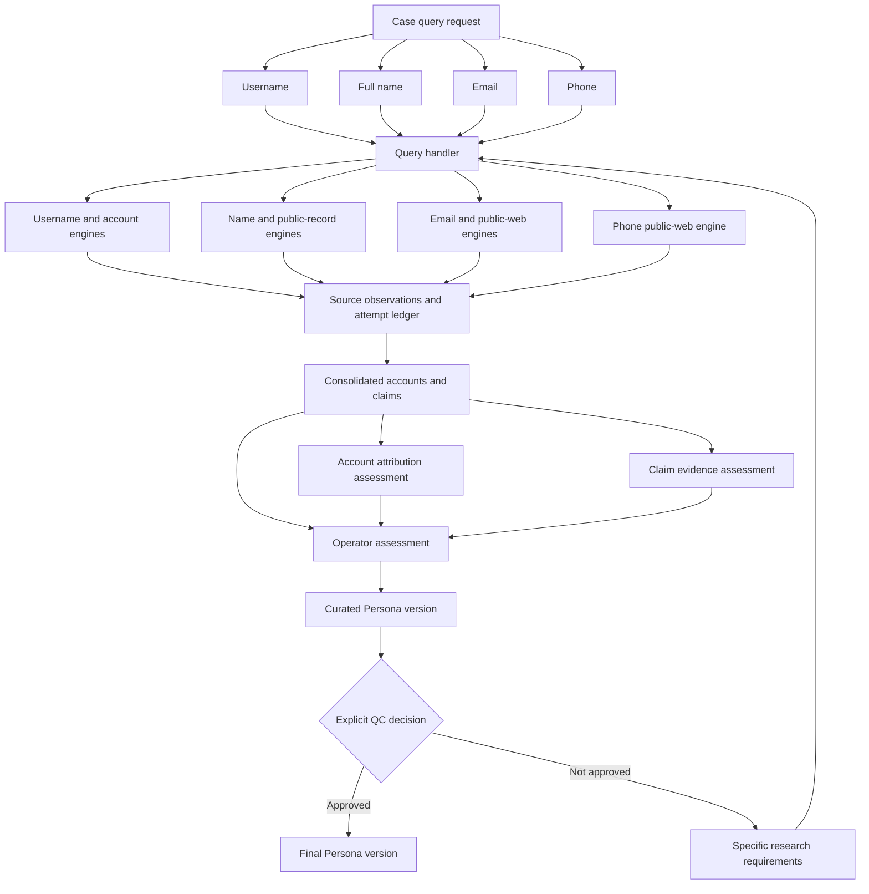

# OpenLedger P2 — complete pipeline implementation proposal

Approval draft · 11 September 2026 · No application implementation, merge, migration, or deployment authorized by this document.

The supplied diagram and the seven requirements in this conversation define the target. Completion means the entire path works: four input types, compatible collection, account/claim consolidation, evidence assessment or direct operator assessment, a curated Persona, explicit version-level QC, and targeted research after failed QC in the existing case. Work packages below are implementation increments, not separate substitutes for that target.

## 1. Verified baseline and limits of this audit

| Item | Finding |
| --- | --- |
| Repository | `nexorusio/openledger` |
| P2 continuation release | [PR #55](https://github.com/nexorusio/openledger/pull/55), open and unmerged when inspected on 11 September 2026 |
| Remote PR head | `f004e719d6bd23e79850379fba67956355736ce2` |
| PR base reported by GitHub | `8f8162dd448a1544eb2ba52f4a63dc00f58e1aff`; this remains the later application line, so do not branch this work from unqualified `main` |
| Audited local checkout | `/workspace/scratch/2a1227d5f229/openledger-p2-followup`, clean, local head `8759a839eee4429f43172fb851f5468ce90a2087` |
| Content reconciliation | Local Git tree `f84724316c3dea6d91a05dd64b6cf20cca45ad95` matches the reviewed tree recorded in PR #55. Local and published commit IDs differ. |
| P2 foundation | PR #55 restores P2 application baseline `288fdd216c1a107113719cc1c850d9fc0dd47808` and adds its documented continuation fixes. |
| Existing schema requirement | `b3e9d7c4a610`, checked by the P2 updater |
| Runtime infrastructure | Flask/Gunicorn, a dedicated Python worker, PostgreSQL/SQLAlchemy/Alembic, Docker Compose and Caddy; optional existing search/provider connections |
| Production verification | No server session or live database was inspected in this turn. Production code, schema, enabled engines, credentials, and current jobs remain a release-preflight check. |
| Test evidence | PR #55 records successful CI and focused regression results. This turn performed a source audit; it did not rerun those tests or execute the proposed tests below. |

The rolled-back tree does not contain `docs/dev/roadmap-state.md` or `docs/dev/multi-agent-runbook.md`. The current instruction to continue P2 governs; old P3 roadmaps are not the implementation authority. Approval of this proposal will not merge or deploy PR #55 or the new continuation.

## 2. Complete target flow

Every arrow carries the original case and subject identifiers. The source ledger and consolidation box make requirement 3 explicit; they implement the meaning of repeated Results A/B in the supplied diagram. A manual source entry follows the same observation/consolidation path and can go straight to operator review. Numerical assessment is never a prerequisite for opening evidence, curating a claim, or conducting QC.

**Who orchestrates:** an OpenLedger query/pipeline service in Python owns the persisted plan and state transitions. The existing dedicated worker executes it. PostgreSQL is the durable authority for tasks, observations, decisions, and versions. AI can propose extracted claims or research questions; it cannot assign collection permissions, approve claims, or pass QC.

## 3. Current-code gaps and implementation changes

All code links in this table are pinned to the published P2 continuation.

| Diagram requirement | What exists | Gap and required implementation |
| --- | --- | --- |
| Four identifiers enter the handler | [investigation_input.py](https://github.com/nexorusio/openledger/blob/f004e719d6bd23e79850379fba67956355736ce2/maigret/web/investigation_input.py), `build_investigation_plan`, understands the four types; PR #55 unifies usernames, handles and supplied profile URLs and defaults to one subject. | `build_investigation_plan` rejects a submission without `search_targets`; `CaseStore.create_investigation` requires a username; `repeat_persona_investigation` does too. Remove this dependency across form, API, store, queue, worker, rerun and reporting. Accept any nonempty supported input set. |
| Route to compatible engines | [app.py](https://github.com/nexorusio/openledger/blob/f004e719d6bd23e79850379fba67956355736ce2/maigret/web/app.py), `_stream_search` and other job handlers, call existing collectors. [profile_search_planner.py](https://github.com/nexorusio/openledger/blob/f004e719d6bd23e79850379fba67956355736ce2/maigret/web/profile_search_planner.py) supports names but explicitly omits email/phone pivots. | Replace fragmented dispatch decisions with one versioned capability registry and persisted route plan. Name-only and email-only collection must work; phone needs the new public-web adapter described below. Existing enrichment job types must use the same handler contract. |
| Consolidate by account/claim with all provenance | [case_store.py](https://github.com/nexorusio/openledger/blob/f004e719d6bd23e79850379fba67956355736ce2/maigret/web/case_store.py) has `persona_claims`, `claim_evidence`, `claim_observations`, `query_receipts` and native search audits. `sync_persona_claims` and `_upsert_persona_candidates` preserve substantial lineage. | Current merging is primarily per-Persona field/value fingerprinting, downstream of report/extractor paths. Add a common observation ledger and case-level account/claim groups before attribution. Preserve unsuccessful and inconclusive outcomes as well as findings, with attempt provenance and source dependence. |
| Probability/evidence assessments | [persona_intelligence.py](https://github.com/nexorusio/openledger/blob/f004e719d6bd23e79850379fba67956355736ce2/maigret/web/persona_intelligence.py) assigns heuristic values such as strong=80, moderate=65, weak=35, unverified=25. Existing updates may take the maximum confidence. [profile_search_ranking.py](https://github.com/nexorusio/openledger/blob/f004e719d6bd23e79850379fba67956355736ce2/maigret/web/profile_search_ranking.py) explicitly ranks review priority. | These are not validated probabilities. Add versioned evidence assessments and separately calibrated attribution/claim models, including uncertainty and abstention. Do not relabel existing scores as probability or combine them by maximum/average as a probabilistic method. |
| Direct operator assessment | Candidate review and `review_claim` already support pending/approved/rejected/uncertain decisions. | Provide one consolidated review workspace, independent of assessment completion. Operators accept, reject, leave unresolved, correct values, resolve bindings and request evidence, with reasons and immutable decision history. |
| Curated Persona profile | Persona fields and approved-only exports already exist. | Curate an explicitly selected, immutable version with included claims, evidence, exclusions, unresolved limitations and a scope definition. A mutable collection of approved fields is insufficient. |
| Explicit QC → final Persona | `get_persona_export_snapshot` reads a consistent database snapshot; [persona_pdf.py](https://github.com/nexorusio/openledger/blob/f004e719d6bd23e79850379fba67956355736ce2/maigret/web/persona_pdf.py) hashes an approved-claim export. | No persistent version-level QC lifecycle was found. Add QC submission, findings, decision, reviewer permission and final-version pointer. Consistent export reads and hashes are useful foundations but are not QC approval. |
| Failed QC → research within the same case | `repeat_persona_investigation` can reuse the same case and Persona. | No structured research requirement tied to a failed QC/version was found. Add requirement records, exact targets and completion criteria, then create linked query runs without deleting the original evidence or decisions. |
| Graph/report delivery | `build_persona_graph` projects claims and sources, with a 120-claim display limit and truncation count; source URLs collapse visually. | Add version-aware final projections, visible pagination and observation drill-down. Final UI, graph, API and PDF must use the same approved version and complete evidence register. Working views must visibly show unapproved state. |
| Safe delivery | [update.sh](https://github.com/nexorusio/openledger/blob/f004e719d6bd23e79850379fba67956355736ce2/deploy/update.sh) requires an exact reviewed commit; [check-p2-release.py](https://github.com/nexorusio/openledger/blob/f004e719d6bd23e79850379fba67956355736ce2/deploy/check-p2-release.py) allows only the current P2 migration chain. | New persistent lifecycle tables require additive migrations. Explicitly update the guard for an approved P2 schema transition; retaining the exact current schema check would make this architecture undeployable. Do not remove safeguards or bypass the guard with renamed P3 code. |

## 4. Query handler and engine contract

An input is targeting context, not an established identity fact. One subject submission creates one stable case subject/Persona shell. Full name plus username plus email plus phone must not create four people. Account candidates remain unassigned hypotheses until operator assessment; an identical handle across platforms does not prove common ownership.

The Username field accepts a plain username, `@handle`, or supported profile URL. Retain original input and URL provenance. Canonicalize using platform rules, including stable account IDs where available; do not assume case folding, punctuation removal, numeric IDs, or URL slug extraction is valid for every platform. Retain unresolved URLs for operator review rather than guessing a username. Phone normalization requires explicit country context when ambiguous; email normalization must not apply provider-specific dot/plus rewriting globally. The operator can correct a predicted type and choose name-derived aliases.

| Engine family in current code | Compatible route in the target | Important condition |
| --- | --- | --- |
| Maigret | Username targets, including operator-selected aliases | Source selection and detector health remain visible; email/phone never masquerade as usernames. |
| User Scanner username modules | Username across supported selected platforms | Retain per-platform outcomes and existing source restrictions. |
| Native major-platform search | Username and full name; supported supplied URL context | Instagram, TikTok, Facebook, Threads and X each receive an explicit plan entry and outcome. A disabled provider or source is visible. |
| User Scanner email checks | Email, independently of username availability | Existing one-address-per-investigation restriction becomes one address per task, all in the same subject/case. Preserve enabled-source controls. Registration evidence does not establish account ownership. |
| Public exact-match search — new adapter using the existing search client | Email and phone; full-name/general public-source research where needed | This is new capability in this proposal. Return source URLs, bounded permitted extracts and fetch outcomes. Phone routes only search public indexed material; no location tracking or subscriber lookup is implied. |
| GitHub public profile | GitHub username or parsed GitHub profile URL | Keep stable account ID and public metadata provenance. |
| Unfurl and Wayback CDX | Supplied or discovered public URL | Unfurl URL analysis and a historical capture are not independent confirmation of current ownership. |
| Wikipedia and ICIJ Offshore Leaks | Person name | Route discovery as a candidate; preserve current confirmed-name checks where required, exposed as conditional tasks. A name match alone is not identity attribution. |
| Wikidata affiliation, GLEIF, French business registry | Names and organization/jurisdiction leads from inputs or reviewed evidence | Keep prerequisites and scope explicit. Organization research remains linked to the originating subject; no automatic relationship inference from shared names. |
| Official public websites and Cloudflare DNS context | Organization website/domain leads | Label public address/contact evidence and DNS context by what each source actually establishes. |
| Google Places business leads and live detail, if configured | Organization names or selected Place IDs | Preserve existing provider storage restrictions; live detail is not automatically durable evidence. |
| Cited AI research, chat proposals and external evidence ingestion | Allowed case context, supplied evidence, or explicit research requirement | Ingest as attributed observations/proposals. User statements and model output do not acquire independent-source status. |

The source registry must be generated/tested against every executable existing adapter, including adapters not represented in `config/osint-sources.json`. An adapter cannot silently drop out during refactoring. New arbitrary data sources remain later integrations, while the common adapter contract supports them.

Each planned task records request, subject, input, engine, platform, prerequisite, source-selection/configuration revision, timeout, retry ceiling, estimated request budget and reason. Persist a plan hash; execution revalidates it against current configuration and records changes. The UI shows Active, Conditional, Unavailable or Excluded with a reason before running. A request with zero active routes creates a visible research-needed case; it cannot claim a successful scan.

Tasks have independent persisted attempts and terminal outcomes: found, not found, candidate, inconclusive/blocked, timeout, error, cancelled, or not executed with reason. Lifecycle state and evidence outcome are separate. A negative result means only that the specified source query produced its defined negative result at that time. Retry only transient faults within the source budget. Crashes, operator stop and lease loss retain committed evidence; resumption creates new attempts and is idempotent. Persist observation plus progress event atomically before reporting it as durable. A task is complete only after its returned observation writes are committed.

## 5. Consolidation and evidence preservation

Account keys use platform and stable platform account ID where available, otherwise a validated canonical profile identity with observed time. Username reuse or a changed stable ID creates a conflict/history event, not silent account continuity. Never merge different platforms merely because handles match.

Claim keys include subject/account hypothesis, predicate, normalized value, role/organization qualifiers and relevant time interval. Separate two employers, conflicting birth dates, and historical versus current affiliations. Consolidation groups equivalent assertions; it does not select truth or overwrite contradicting assertions.

For the diagram's example, Engine A Result A, Engine B Result A and Engine C Result A produce one relevant account/claim group with three engine observations. If they all derive from one original page, show three observations and one original evidence family. An independent registry result may add another evidence family. Mirrored pages, cached copies, search snippets and LLM summaries do not manufacture independent corroboration.

The ledger retains case/request/task/attempt IDs, native source record ID, original and canonical URLs, native outcome, engine and parser versions, retrieval time, source publication/effective time when available, source-origin family, content fingerprint, permitted payload/artifact reference, and extraction lineage. Unknown dependence remains unknown. Replaying the same attempt produces no duplicates; a genuine later observation remains a distinct historical observation even if its content is unchanged.

Account grouping and Persona binding are different decisions. Operators can split an erroneous account group or reassign a proposed binding with a recorded reason. This appends a grouping/decision revision and triggers reassessment; it does not rewrite the prior source observation. Evidence reuse across cases retains the original evidence ID and independently scoped claims/decisions; sharing a source does not merge cases or people.

**Retention exception requiring approval:** preserve all source evidence that OpenLedger may retain, together with complete provenance. Some configured providers, especially current Google Places live detail, do not permit the same storage as ordinary public-page evidence. For these, preserve permitted identifiers and retrieval/status metadata, label non-reproducible live detail, and do not publish transient facts as durable final claims without retainable supporting evidence. This exception is explicit; the plan does not promise to archive prohibited raw responses.

## 6. What probability means and validation

Two separate events are proposed for the diagram's assessments:

| Assessment | Defined event and unit |
| --- | --- |
| A — Account attribution | Probability that a specified platform account belonged to or was operated by this case subject at the stated observation time, conditional on the eligible evidence and the defined deployment population. Unit: subject/account/time hypothesis. |
| B — Claim correctness | Probability that a specified normalized claim about this subject, including its qualifiers and time interval, is correct under an independent reference-label protocol. Unit: subject/predicate/value/qualifier/time hypothesis. |

Account existence/fetch status, evidence support, independence, freshness, review priority, operator decision and QC state remain separate fields. A single profile-wide percentage is not proposed. Assessment B must not assume attribution merely because A is high; use a model validated for the joint subject-claim event, or abstain. Do not multiply A and B without a separately validated conditional model.

Operationally, an 80% prediction means that among comparable, independently adjudicated hypotheses receiving predictions near 80%, approximately 80% should be correct. It is an empirical estimate under a named model, population and date range, not certainty about an individual. Calibration requires evidence on held-out data; reliability curves compare predictions with observed positive fractions, while proper scores also assess overall predictive quality. [Probability calibration documentation](https://scikit-learn.org/stable/modules/calibration.html).

Implement an interpretable regularized logistic model for each supported event/claim family with a separately fitted sigmoid calibrator. Features come from source-backed matches, contradictions, stable IDs, dates, extraction quality, detector health and evidence-family dependence. Retain feature definitions and contributions. Evidence checks also enforce invariants outside the statistical model: duplicating an origin cannot raise its weight; blocked sources are not negative identity evidence. Sparse or unsupported families abstain. Training/calibration can use a pinned evaluation environment; the worker can evaluate a reviewed coefficient/calibration artifact without adding a model service.

Before empirical validation, display a clearly named evidence assessment with `probability = null` and a reason such as not calibrated, insufficient evidence or outside validated scope. Legacy confidence and LLM-proposed scores stay labelled as heuristic. The full implementation includes probability training, evaluation, artifact versioning and serving; numeric readiness remains an open acceptance gate until it passes. It will not be described as completed calibrated probability merely because the evidence-only path works.

**Validation protocol and proposed thresholds — targets, not measured results:**

1. Create a versioned, source-backed reference set using authorized/public examples. Label each event positive, negative or unresolved with documented evidence and reference date. Use two independent human labels, blinded to model scores, and adjudicate disagreements. QC approval is not automatically a ground-truth label.
2. Initially target at least 3,000 adjudicated examples per event, across at least 500 distinct subjects, then expand as required for the gates. Use a representative candidate stream, including difficult collisions, common Indonesian names, renamed/reused handles, shared organizational contact details, contradictory sources and missing results. Additional enriched challenge sets are reported separately from the population-weighted calibration evaluation.
3. Split by subject, account and original-source family, approximately 60% training, 20% calibration and 20% locked test, with a later-time evaluation window. No copies, repeated cases or related account observations may leak across splits. Fit all learned processing on training data. Keep at least 500 independently adjudicated test hypotheses per event; collect more data if clustered dependence or subgroup coverage makes this insufficient.
4. Compare Brier score and log loss with a constant-prior baseline fitted without test labels and with the uncalibrated model. Both must improve over the prior baseline; the calibrated model must not materially worsen either proper score. Publish reliability diagrams, sample counts, confidence intervals and ten-bin expected calibration error (ECE). Proposed ECE gate: no more than 0.05 overall and 0.10 in adequately sampled declared slices. Do not treat ECE alone as proof of calibration.
5. For a displayed high-attribution band, initially probability at least 0.95, require observed precision at least 98%, with a 95% lower confidence bound at least 95%, across at least 300 independently adjudicated band examples. The threshold is chosen on calibration data and evaluated once on the locked test. Use subject-cluster bootstrap intervals for dependent examples; Wilson intervals apply to independent binomial examples. [NIST confidence interval guidance](https://www.itl.nist.gov/div898/handbook/prc/section2/prc241.htm).
6. Report precision, recall, false-association rate, abstention rate and probability coverage by platform, input type, language and claim family. A supported reporting slice needs at least 100 test examples and both classes; otherwise label it insufficiently validated and withhold its numeric output. Do not pool unrelated claim families to manufacture sample size. High precision with near-total abstention must be visible through coverage.
7. Freeze evaluation data/version, model/calibrator version, feature schema, evidence digest, decision threshold and operating scope. Repeat validation after source/parser/model changes or detected drift. Run a rolling audited sample monthly and after material source changes; suspend numerical output for failing scopes while review and evidence access continue.

The reference set is a real dependency. No qualifying labelled dataset was located or validated in this turn. The implementation can include collection fixtures and the full evaluation harness, but synthetic examples cannot establish production probability calibration. General internet discovery recall is also not measurable without a defined reference set.

## 7. Operator assessment, versioning and QC

Operator assessment displays consolidated accounts and claims, every source observation, contradictory evidence, assessment explanations, and uncompleted collection routes. It works when a model/provider is disabled. Operators can include, exclude, reject or leave unresolved a claim; edit by creating a new revision; correct an account binding; and request further research. Inclusion requires an attributable source and an explicit decision. Rejection does not delete evidence. Existing claim review semantics remain available and are linked to the new immutable decision records.

A curated Persona version contains a frozen manifest of selected claim revisions, account bindings, exact evidence/observation revisions, operator decisions, assessment versions, scope, exclusions and limitations. Give each version an ID, sequence number, creation actor/time, parent version and content hash. Inputs/subject shells are clearly distinguished from curated facts.

Lifecycle: working draft → submitted for QC → approved final or changes required. Submission freezes the version. Corrections create a successor; the submitted version cannot be edited in place. Later discoveries do not modify an existing final. They create a new draft and, when relevant, an explicit review-needed notice on the final. Final references remain addressable and can be marked withdrawn/superseded by an audited decision.

QC checks at least:

- The submitted version and evidence digest are still the ones reviewed; concurrent updates cannot pass a stale approval.
- Every included claim has a resolved subject/account binding, review decision and accessible retained provenance.
- Contradictions are resolved or explicitly excluded from the final facts with a documented limitation. A material unresolved identity contradiction blocks finalization.
- All required research requirements are resolved against their completion criteria or explicitly waived by the reviewer with a reason. Finishing a collection job alone does not resolve a requirement.
- Mandatory fields/research objectives defined for that case have dispositions; unknown fields can remain unknown where the agreed scope allows this.
- Location and relationship statements use the precision supported by evidence; an approximate city center cannot be published as an exact affiliation address.
- The final profile, graph, API and report agree on included facts and version ID. Numerical probabilities satisfy their validation gates, or are explicitly unavailable.

Only an authenticated user with QC permission may submit the approval action. Proposal: extend the existing roles with a QC permission assigned by an administrator; an administrator can perform QC initially. QC is always a separate action. Permit the same operator to perform that action in a single-operator deployment, visibly recorded. Mandatory second-person approval is not assumed by the supplied diagram and would require an explicit policy choice. AI/background workers never hold QC approval authority.

Approval stores reviewer, time, scope/checklist, exact version hash and rationale, then atomically updates the final-version pointer. It cannot be implied by scan completion, claim approval, a high probability or clicking Export. Existing Personas import as legacy working material with their review history intact; none become final automatically.

Working exports are labelled Draft. Final exports require a QC-approved version ID and include a complete evidence register and finalization metadata. Persist an export manifest and any permitted media assets so a later live fetch cannot silently change a final export. The graph may page or progressively load dense data but must expose every included claim and observation; visual grouping does not drop provenance. Working and final cross-case relationships keep source case/version references and do not automatically assert personal relationships.

## 8. Failed QC and the research loop

Each failed QC finding creates one or more structured requirements with case ID, subject ID, failed version/QC IDs, question, target claim/account, reason, required evidence type, proposed inputs/engines, priority, request/time budget and measurable completion criteria. Example: “Determine whether Instagram account A belongs to this subject; obtain an independent public profile link connecting it to the already reviewed organization page.” “Research more” is insufficient.

The query handler consumes these requirements, resolves compatible tasks and records any needed operator selection using the existing collection controls. Approved configured routes can execute under the case budget; expanding an external data scope uses the applicable operator controls. Requirements without a compatible enabled engine remain visible and can be handled manually; the system must not fabricate a query or mark them resolved.

Store each follow-up request with the same `case_id` and `subject_id`, the parent request, originating QC/version and requirement IDs. New evidence is appended and affected assessments are recomputed. Preserve accepted/rejected decisions; changed or contradictory evidence is presented for fresh review rather than silently reversing them. The operator resolves or contests the requirement, creates the next curated version and submits it to QC again. Task idempotency keys, depth/budget limits and duplicate requirement detection prevent runaway loops. Failed QC never deletes the prior case, resets its evidence, or starts an unrelated investigation.

## 9. Proposed code and data changes

Names below are proposed contracts, not files already implemented.

| Work package | Code ownership and durable records | Reviewable output |
| --- | --- | --- |
| W1 — contracts and migrations | Add `pipeline_contract.py` and a capability registry; extend the current SQLAlchemy store. Add query requests, case subject inputs, collection tasks/attempts, common source observations and account/claim group membership. Link existing receipts, jobs and evidence instead of copying provenance blindly. | Schema diagram, constraints, migration/rollback compatibility proof and adapter inventory. |
| W2 — handler and execution | Adapt `investigation_input.py`, route/API handlers and `worker.py`; add a query-handler service and the exact-match public-web adapter. Replace username-only queue invariants. | Each single input type and mixed input executes the right existing/new adapters with visible outcomes and durable partial work. |
| W3 — consolidation | Add account and qualified claim canonicalization, observation membership and original-source dependence; bridge existing extractor outputs and native candidate audits. | Same claim from three engines produces one group, all three observations, contradictions intact and no accidental identity merge. |
| W4 — assessment | Add assessment snapshots, evidence rules, probability artifacts/registry and evaluation harness. Link assessment to a frozen evidence-set hash. | Explained assessments, calibrated artifact pathway, explicit abstention and the empirical evaluation report when data are available. |
| W5 — operator and curated versions | Extend existing candidate/claim review endpoints and templates; add immutable operator decisions, Persona versions and version items/bindings. | Full review experience and versioned draft that can be exported as Draft. |
| W6 — QC and feedback | Add QC decisions/findings, QC permission, research requirements and requirement-to-request links, with atomic state transitions. | Approve to final; reject to specific research in the same case; rerun, revise and approve. |
| W7 — final presentation | Update Persona, relationship graph, report/API/chat evidence projections to distinguish working from final and pin final output to its manifest. | Consistent final profile, graph, API and PDF with complete lineage and expandable/paged dense data. |
| W8 — integration and release | New end-to-end PostgreSQL/worker/browser tests, fault/load tests, migration rehearsal, P2 release manifest and updater changes. | One complete acceptance record and an exact release candidate for separate merge/deployment decisions. |

Use PostgreSQL transactions, uniqueness constraints and foreign keys to enforce scope, attempt idempotency, version immutability and valid state transitions. A normalized observation can support multiple hypotheses without losing its origin. A hypothesis may exist without a Persona claim until operator inclusion. Existing `claim_reviews` and provenance tables remain readable; append new relationships/revisions rather than destructively changing historical decisions.

Additive migrations originate from the approved P2 head and are part of this proposal's implementation scope. Migration identifiers, exact checksums and accepted source/target schema transitions are fixed before release review. Default-off feature activation permits backfill/comparison before use. Backfill has dry-run counts, batch checkpoints and collision reports; absent original evidence is marked legacy/incomplete rather than invented. Re-running backfill must make no additional logical records. Old deletion routes must not cascade into protected version evidence; final-linked evidence receives retention-aware protection and explicit withdrawal/purge handling.

## 10. Acceptance tests and quantitative release gates

Every item below is proposed and unexecuted. Automated engineering tests use synthetic identities and deterministic source fixtures; provider and probability validation have separate evidence requirements.

| ID | Test | Passing result |
| --- | --- | --- |
| A01 | Submit username, full name, email and phone independently, plus mixed combinations | Each accepted input creates a case subject and truthful plan without requiring a username; compatible enabled routes execute. |
| A02 | Submit name + handle + `@handle` + supplied profile URL for one subject | One subject/Persona shell, deduplicated appropriate username tasks, every raw input/source URL retained. |
| A03 | Override a numeric input's type; use ambiguous phone country, unsupported URL and name aliases | Correction is honored end to end; no guessed account ID/country/alias silently enters execution. |
| A04 | Run the complete adapter inventory with fake providers | 100% of configured eligible adapters represented; every selected/excluded/conditional/unavailable source has an explicit reason and state. |
| A05 | Include Instagram/TikTok; test found, blocked, timeout and excluded cases | All four outcomes remain inspectable; blocked/error is never rendered as an absent account. |
| A06 | Email-only multi-address subject and phone-only public evidence fixture | Per-address/number tasks attach to the same subject and correct originating input; no new unrelated case is required. |
| A07 | Engines A/B/C return the same account or qualified claim | One canonical group, three distinct observation lineages, no source loss. |
| A08 | Duplicate mirror/snippet/model summary versus independent registry evidence | Copying one origin 100 times does not increase independent evidence or probability; independent origin is separately attributable. |
| A09 | Same handle on different platforms/people; reused username and conflicting stable IDs | No automatic cross-person/platform merge; temporal identity collision is visible and reviewable. |
| A10 | Contradictory values and historical/current affiliations | All evidence retained; claim qualifiers distinguish history; conflict blocks unsupported final facts. |
| A11 | Replay the same delivery/backfill; make a genuine later observation | Zero duplicate logical writes on replay; later observations retained with their own time/attempt. |
| A12 | Disable assessment/AI, then review consolidated evidence directly | Operator can curate and submit to QC; no model dependency blocks this diagram path. |
| A13 | Assert unsupported probabilities, absent model, stale evidence hash and invalid calibration scope | Numeric probability is unavailable with a reason; heuristic scores are not labelled probability. |
| A14 | Execute the model validation protocol | Locked test gates in section 6 pass for every scope displaying numbers; report label count, metrics, intervals, coverage and abstention. Synthetic test success cannot satisfy this gate. |
| A15 | Edit a curated claim, reverse a decision and submit successive versions | Prior decisions/evidence/versions unchanged; new revisions capture actor, time and reason. |
| A16 | Try Export, high score, job completion or claim approval without QC | None produces a Final Persona; export remains Draft. |
| A17 | QC with missing provenance, unresolved material identity conflict, unmet requirement or stale submitted version | Approval is rejected transactionally; findings identify the exact failing claims/requirements. |
| A18 | QC approval by permitted user; unauthorized user/background process attempt | Authorized action creates one final version and audit entry; unauthorized path has zero finalization effects. |
| A19 | Failed QC → requirement → handler → collection → operator revision → QC approval | Case/subject IDs remain identical; failed version, all prior evidence and new observations remain accessible; final is the new approved version. |
| A20 | Duplicate/unsatisfiable requirements, budget exhaustion and retry | No infinite loop or unrelated case; unresolved reasons visible; job completion alone does not close a requirement. |
| A21 | Add fresh contradicting evidence after final approval | Published final remains byte/logically stable; review-needed notice and successor draft appear; no silent mutation. |
| A22 | Export and inspect final Persona/graph/API/PDF, including more than 120 claims | 100% of included claims have matching version/claim/evidence identifiers; all evidence is reachable through pages/drill-down and the export register. |
| A23 | Reuse one evidence item in two cases and test foreign case/version IDs | Both cases retain their own decisions; cross-case misuse is rejected; shared evidence does not become an asserted personal relationship. |
| A24 | Stop, timeout, network error, provider throttling, worker kill, lease loss and restart | Every committed observation survives; one terminal task outcome, bounded retries, no stale worker finalization, explicit interruption/partial state. |
| A25 | Backfill historical P2 cases and export before/after comparison | Legacy evidence/reviews preserved; none auto-finalized; repeat migration/backfill is idempotent. |
| A26 | Delete a job/case referenced by a final version; withdraw a version | Normal deletion cannot silently erase final provenance; explicit retention/withdrawal behavior preserves auditability. |
| A27 | Run updater without SHA, on wrong tree/channel/schema, dirty checkout or unknown migration | Refusal before runtime writes. `--check` remains read-only. Approved exact transition succeeds only for the reviewed release. |
| A28 | Container build plus PostgreSQL migration, rollback rehearsal and browser acceptance | Required CI gates pass; worker/UI reconnect retains state; rollback compatibility and manual end-to-end workflow are demonstrated. |

For a deterministic load/fault scenario, exercise at least 50,000 returned observations with 10% duplicates and 10% injected failed/blocked/timed-out attempts, across multiple engines. The reconciliation invariant is 100% of fixture observations and planned tasks accounted for, zero lost committed evidence, zero duplicate logical writes and zero cross-case attribution errors. This measures engineering integrity, not source accuracy or internet discovery recall.

Proposed interactive budget on a staging host sized like production, with a 50,000-observation case and five browser readers: p95 paged review API response under two seconds, first usable review view under three seconds, durable progress visible within five seconds, operator stop acknowledged within two seconds and collection quiescent within thirty seconds. Exclude external provider latency from local API timing; report it separately. Record host, CPU/RAM, concurrency and data sizes. An unkillable provider call fails the bounded-cancellation gate and must be isolated/supervised before release. These are targets to test, not current measured capabilities.

For first-attempt collection quality, publish three separate ratios on the agreed public reference set: (1) attempts with a substantive finding/defined negative outcome divided by eligible attempted queries, (2) correct subject-attributed accounts divided by adjudicated returned candidates, and (3) discovered known accounts divided by all eligible known reference accounts. Include abstentions and provider failures in separate disclosed counts; do not drop them to inflate coverage. For graph fidelity, require 100% of curated final claims represented or reachable and 100% of rendered final factual edges traceable to approved version evidence; shared-attribute edges remain explicitly labelled as such.

## 11. Deviations and additions presented for approval

| Item | Proposal and reason |
| --- | --- |
| Overall diagram | No stage or feedback arrow is removed. This is the complete required target. |
| Account/claim consolidation | Make it a first-class stage between engines and assessments, as required by the user's textual explanation of the diagram. |
| Early Persona record | Keep a stable subject/Persona shell at case creation for compatibility and linkage. It is visibly uncurated; the curated profile is produced only by operator assessment. |
| Numerical probability | Gate numerical output on empirical calibration. Evidence assessment and direct operator paths always remain available. Numeric validation is tracked as incomplete when labels/gates are unavailable. |
| Phone and independent email/name routing | Add/extend compatible adapters and remove username-only requirements. Merely retaining these values as context would fail the requested target. |
| Source evidence retention | Use the explicit provider-retention exception in section 5; final facts require retainable evidence. |
| QC staffing | Separate QC action and permission; same human may perform both steps initially, recorded transparently. A compulsory second reviewer is not assumed. |
| Schema and delivery guard | Add reviewed P2 migrations and a versioned P2 release manifest. The current schema-only guard must be deliberately extended, while exact-commit deployment and refusal of unapproved P3 trees remain enforced. |
| Runtime stack | Extend the existing Python/PostgreSQL/Compose stack. The diagram does not require a new orchestration SaaS or graph database; existing optional providers remain explicit dependencies. |

Any further deviation discovered during implementation must be reported with its reason and impact before substituting it for the approved behavior.

## 12. Safe delivery sequence and approval boundaries

1. **Approve this complete plan.** This authorizes implementation and necessary local/staging verification, including the described additive schema/guard design. It does not authorize merge, production migration, deployment, provider purchases or sending real case data to new providers.
2. **Pin and reconcile the P2 base.** Recheck PR #55 state and content; create an isolated continuation branch, proposed `codex/p2-end-to-end-pipeline`, from the reviewed P2 content. If PR #55 is still unmerged, keep this work stacked/dependent on it. If it was squash-merged, verify tree equivalence before rebasing. Do not select current `main` merely because it is named main; do not restore P3/P3X/P3R implementation commits.
3. **Implement W1–W8 with visible requirement tracking.** Checkpoint code and test evidence in logical increments. All seven diagram requirements remain part of acceptance; intermediate work is not called the completed pipeline. Preserve existing UI controls, review decisions, provider restrictions and features through explicit adapter/regression coverage.
4. **Rehearse migration and rollout locally/staging.** Use disposable PostgreSQL fixtures and, only when appropriately authorized/available, a protected staging copy for migration reconciliation. Apply additive migrations and resumable backfill, compare counts/hashes, exercise feature-off and feature-on behavior, and demonstrate a complete QC rejection/research/reapproval journey. No production data are needed for deterministic tests.
5. **Complete engineering and empirical gates.** Run the required repository regression matrix, persistence integrity, static/security/source audit, container and browser tests plus the new acceptance matrix. Validate probabilities against the independent labelled set. If empirical data are unavailable, report that gate as blocked rather than announcing full calibrated readiness. Show the operator the actual result and final export before requesting release approval.
6. **Prepare one exact release candidate for review.** Record full commit, tree, container image digest, expected current/target schema and migration checksums, feature settings, validation report and rollback procedure. The proposed manifest expands the allowed P2 transition; it cannot be a generic allow-any-migration switch. Keep changes reviewable in a draft PR; publication follows the existing repository authorization boundary.
7. **Separate merge authorization.** Request approval for that exact reviewed candidate. No direct push to main, implicit merge or production update. Reconcile squash commit/tree and rebuild/reverify the final release identity as required.
8. **Separate deployment authorization.** Before asking, prepare the exact commands and outputs expected from preflight, backup/restore rehearsal, migration, start, health checks, browser verification and rollback. Then obtain authorization for that specific release and production schema transition. No deployment commands need to be run by the user now.
9. **Deploy only the approved identity.** Preflight checks current running code/schema, clean checkout, no conflicting active work, capacity and backup availability before mutation. Pin the exact reviewed commit/image; never use an unqualified `git pull`, moving `latest` tag, or Docker update as release selection. Drain jobs, create and verify database and evidence/settings backups, apply only manifest-listed migrations, start matching app/worker builds, and perform human acceptance. Docker restarts/upgrades must not select another application line.
10. **Rollback without destroying the new record.** Build and test a P2 compatibility rollback release that understands the expanded schema and protects new version/evidence records, or use a tested restricted/read-only mode while disabling the new workflow. Do not assume PR #55's old updater can run after a new schema, or let old cascade/delete paths operate on final-linked records. Keep additive tables on code rollback. Database restore is a separate recovery action with an explicit post-backup data reconciliation plan, not an automatic response to a UI failure.

The final release gate requires both automated evidence and a human demonstration: enter the supplied identifiers, inspect engine coverage, see consolidated evidence, curate, reject in QC, run the resulting targeted research in the same case, revise, approve, and verify that the final profile/graph/report agree. The final status must explicitly distinguish engineering readiness, numerical probability readiness and production acceptance.

**Requested next action:** approve this complete P2 implementation proposal, including the explicit decisions in section 11, or identify the decisions to change. No merge or deployment authorization is requested at this stage.
